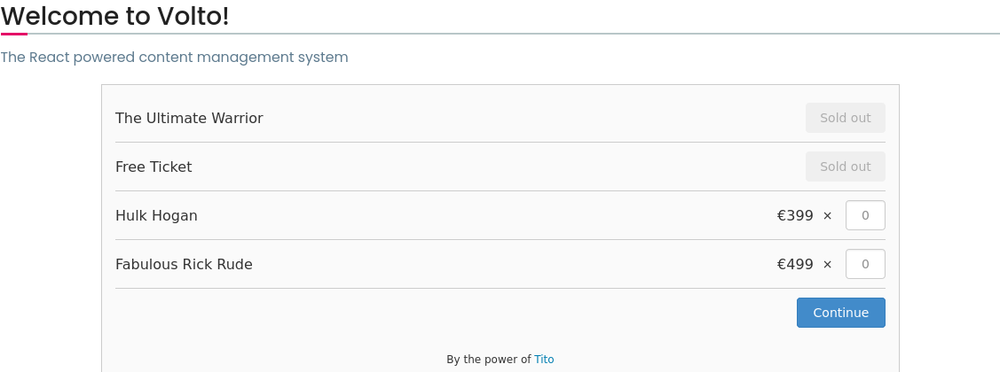
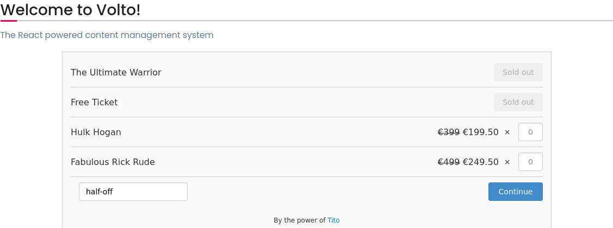

# Tito Block for Volto (@plone-collective/volto-tito-block)

[](https://www.npmjs.com/package/@plone-collective/volto-tito-block)
[](https://collective.github.io/volto-tito-block/)
[](https://github.com/collective/volto-tito-block/actions/workflows/code.yml)
[](https://github.com/collective/volto-tito-block/actions/workflows/unit.yml)

[Tito](https://ti.to/) is a platform for selling tickets online.

This addon implements a block integrating the [Tito Widget V1](https://ti.to/docs/widget) to [Plone](https://plone.org) projects with a [Volto](https://github.com/plone/volto) user interface.

## Screenshots

### New Block


### Block



### Block with Discount



## Examples

@plone-collective/volto-tito-block can be seen in action at the following sites:

- [2022.ploneconf.org](https://2022.ploneconf.org)

You can also check its [Storybook](https://collective.github.io/volto-tito-block/).

## Install

### New Volto Project

Create a Volto project

```shell
npm install -g yo @plone/generator-volto
yo @plone/volto my-volto-project --addon @plone-collective/volto-tito-block
cd my-volto-project
```

Install new add-on and restart Volto:

```shell
yarn install
yarn start
```

### Existing Volto Project

If you already have a Volto project, just update `package.json`:

```JSON
"addons": [
    "@plone-collective/volto-tito-block"
],

"dependencies": {
    "@plone-collective/volto-tito-block": "*"
}
```

### Integration with [@kitconcept/volto-blocks-grid](https://github.com/kitconcept/volto-blocks-grid)

If you already have a Volto project, just update `package.json` and make sure `@kitconcept/volto-blocks-grid` is listed before `@plone-collective/volto-tito-block` in **addons**:

```JSON
"addons": [
    "@kitconcept/volto-blocks-grid",
    "@plone-collective/volto-tito-block"
],

"dependencies": {
    "@kitconcept/volto-blocks-grid": "*",
    "@plone-collective/volto-tito-block": "*"
}
```

### Test it

Go to http://localhost:3000/

## Contribute

- [Issue Tracker](https://github.com/collective/volto-tito-block/issues)
- [Source Code](https://github.com/collective/volto-tito-block/)

## Credits

The development of this add on was sponsored by the Plone Foundation

[](https://plone.org/foundation)

## License

The project is licensed under [MIT](./LICENSE).
